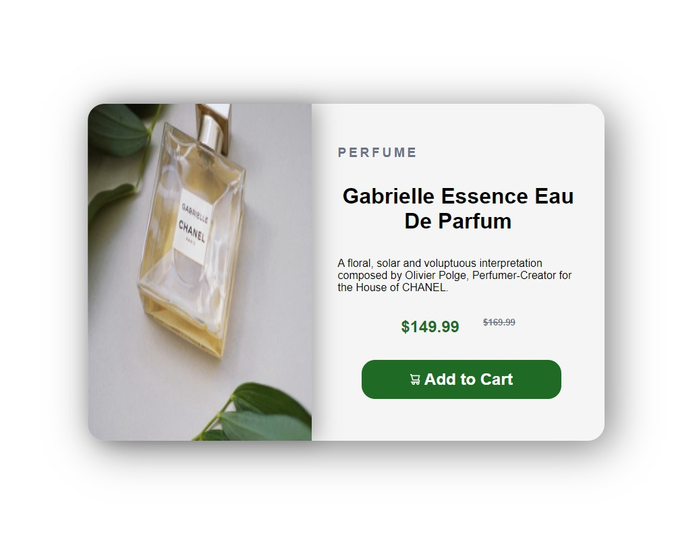
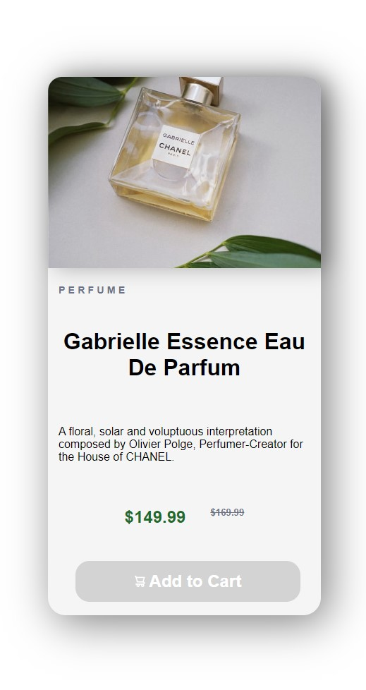

# Mys solution of "Product preview card component"

This is a solution to the [Product preview card component challenge on Frontend Mentor](https://www.frontendmentor.io/challenges/product-preview-card-component-GO7UmttRfa). Frontend Mentor challenges help you improve your coding skills by building realistic projects.

## Table of contents

- [Overview](#overview)
  - [The challenge](#the-challenge)
  - [Screenshot](#screenshot)
  - [Links](#links)
- [My process](#my-process)
  - [Built with](#built-with)
  - [What I learned](#what-i-learned)
  - [Continued development](#continued-development)
- [Author](#author)

## Overview

### The challenge

Users should be able to:

- View the optimal layout depending on their device's screen size
- See hover and focus states for interactive elements

### Screenshot





### Links

- Solution URL: [Add solution URL here](https://your-solution-url.com)
- Live Site URL: [Add live site URL here](https://your-live-site-url.com)

## My process

### Built with

- Semantic HTML5 markup
- CSS custom properties
- Mobile-first workflow

### What I learned

First time using the srcset, need to iprove some skills

```html

```

Some media responsive transform

```css
@media only screen and (max-width: 600px) {
    .card{
        flex-direction: column;
    }
    .card-img-holder
    {
        min-height: 100%;
    }
    .card-img-holder img{
        border-top-left-radius: 20px;
        border-top-right-radius: 20px;
        border-bottom-left-radius: 0;
        border-bottom-right-radius: 0;
    }

    .card-desc{
        min-height: 450px;
        width: 100%;
        justify-content: space-between;
        padding: 5% 0;
    }

    .card-desc p{
        margin: 15px 15px;
    }

    .card-desc h3{
        margin: 0 15px;
        font-size: .9rem;
    }

```

### Continued development

-- Improve responsive design.
-- Upgrade HTML knowledges

## Author

- Frontend Mentor - [@Mrintoxx](https://www.frontendmentor.io/profile/mrintoxx)
